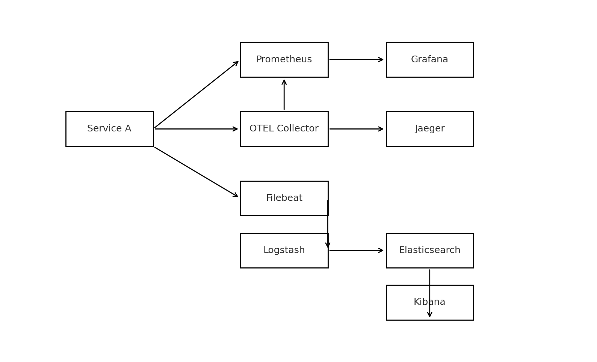

# Mini Observability Platform

A minimal, containerised observability stack with demo FastAPI services instrumented for **metrics**, **traces**, and **logs**.

 <!-- Add an architecture image later -->

## Stack

| Layer | Tech |
|-------|------|
| **Service** | FastAPI + Prometheus Instrumentator + OpenTelemetry |
| **Metrics** | Prometheus + Grafana |
| **Traces**  | OpenTelemetry Collector + Jaeger |
| **Logs**    | Filebeat → Logstash → Elasticsearch → Kibana |
| **CI/CD**   | GitHub Actions • GitLab Runner |

## Quick Start
```bash
git clone https://github.com/AmirHSad/mini-observability-platform.git
cd mini-observability-platform/compose
docker compose up -d --build
```

### Scaling

Run multiple instances of `service_a` to handle more traffic:

```bash
docker compose up --scale service_a=2 -d
```

Each replica exposes metrics, traces and logs with a unique
`service.instance.id` derived from the container hostname. This allows
Grafana, Jaeger and Kibana to distinguish between instances when the
service is scaled.

Access UIs:

- Grafana: <http://localhost:3000> (admin / admin)
- Prometheus: <http://localhost:9090>
- Jaeger: <http://localhost:16686>
- Kibana: <http://localhost:5601>
- Service A: <http://localhost:8000/docs>

## Development

```bash
# start only service_a
uvicorn services.service_a.app.main:app --reload
```

Lint and tests (both CI systems run these):

```bash
black --check .
isort --check .
flake8 .
pytest
```

## CI pipelines

- **GitHub Actions:** `.github/workflows/ci.yml`
- **GitLab Runner:** `.gitlab-ci.yml`

Both pipelines lint, test, build a Docker image and push (to GHCR or GitLab registry).

---

© 2025 MIT
